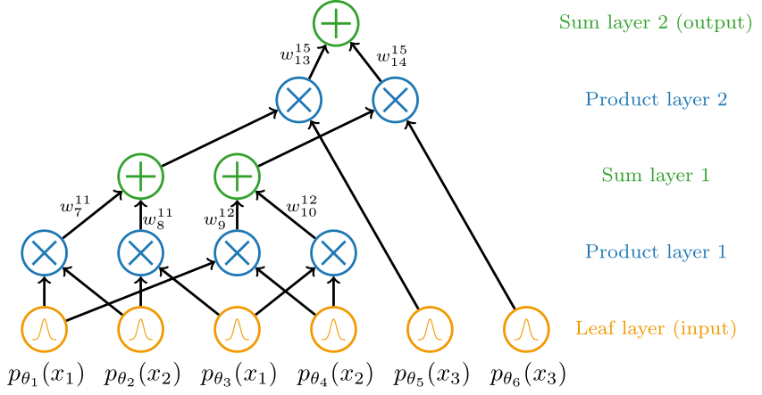
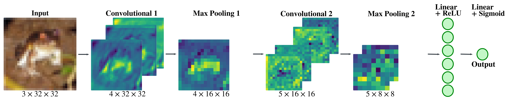

## Machine Learning Explainers

This repo contains my Tex files as well as a compiled PDF of my summaries of a machine learning-related topics. The intention of writing these summaries is reminding my future self.

Hello, future Dewi 💃🏽

## Some of my lovely Latex-made figures:

**A multi-layer perceptron:**

**A probabilistic circuit:**

**Forward passing a frog through a convolutional neural network:**
